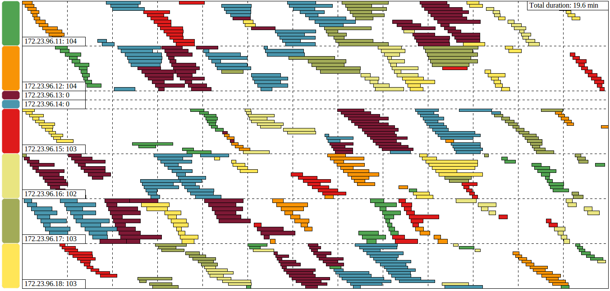

moveit
------

A handy tool for [master events](https://github.com/couchbase/ns_server/blob/master/doc/master-events.txt) analysis.

Prerequisites
-------------

* Python 2.7/3.x
* pip

Installation
------------

    pip install moveit

Usage
-----

    $ moveit -h
    usage: moveit [-h] [-t THRESHOLD] filename

    positional arguments:
      filename      path to master events log

    optional arguments:
      -h, --help    show this help message and exit
      -t THRESHOLD  hotspot threshold in %

    $ flow -h
    usage: flow [-h] filename

    positional arguments:
      filename    path to master events log

    optional arguments:
      -h, --help  show this help message and exit

Example
-------

Master events profiler:

    $ moveit master_events.log | head -n 20
    bucket-1: 512 movements, mean: 358.4s, max: 1278.2s, min: 10.5s
          86: 577.5s
              vbucketMoveStart -> vbucketStateChange: 0.0%
              vbucketStateChange -> vbucketStateChange: 0.0%
              vbucketStateChange -> tapEstimate: 0.0%
              tapEstimate -> tapEstimate: 0.0%
              tapEstimate -> indexingInitiated: 0.0%
              indexingInitiated -> backfillPhaseEnded: 0.3%
              backfillPhaseEnded -> checkpointWaitingStarted: 0.0%
              checkpointWaitingStarted -> checkpointWaitingEnded: 2.5%
              checkpointWaitingEnded -> vbucketStateChange: 0.0%
              vbucketStateChange -> checkpointWaitingStarted: 0.0%
              checkpointWaitingStarted -> checkpointWaitingEnded: 4.1%
              checkpointWaitingEnded -> waitIndexUpdatedStarted: 0.0%
              waitIndexUpdatedStarted -> waitIndexUpdatedEnded: 92.8%
              waitIndexUpdatedEnded -> vbucketStateChange: 0.1%
              vbucketStateChange -> vbucketMoverTerminate: 0.0%
              vbucketMoverTerminate -> vbucketStateChange: 0.1%
              vbucketStateChange -> updateMap: 0.0%
              updateMap -> vbucketMoveDone: 0.0%

Flow visualization:

    $ flow master_events.log

See `bucketname_master_events.log.svg` for output.

